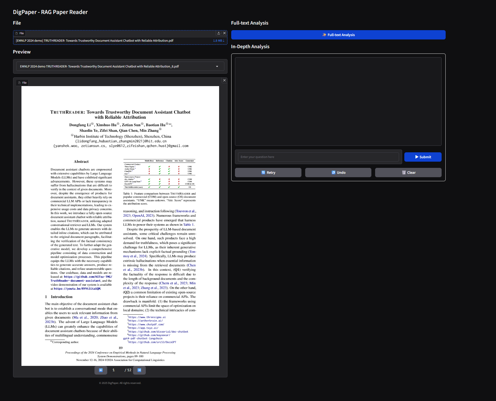
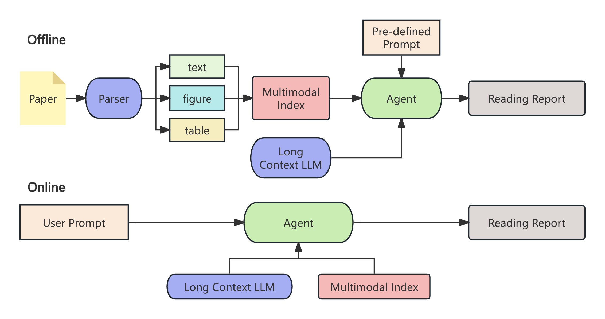

# DigPaper: RAG-based Paper Reading Agent
**DigPaper** is a paper-reading agent that leverages multimodal RAG (Retrieval-Augmented Generation) for precise information extraction from research papers.
With DigPaper, you can not only generate a detailed reading report summarizing a paper but also interactively ask questions about it.



## Workflow
The DigPaper workflow can be divided into two stages: Offline and Online.
- Offline stage: Extracts content from papers and generates a structured reading report.
- Online stage: Supports interactive dialogue between the user and DigPaper for deeper exploration.



## Getting Started

### Step1: Deploy Nougat and LayoutLMv3 API Services

Please refer to the offical repository for setup:
 - [Nougat](https://github.com/facebookresearch/nougat)
 - [layoutLMv3](https://github.com/microsoft/unilm/tree/master/layoutlmv3).

For Nougat, API service can be deployed with the following command:

```bash
$ nougat_api
```

The default endpoint is http://127.0.0.1:8503/predict/.

For LayoutLMv3, since no official API is provided, we include a lightweight [script](./layoutlm_api/app.py).
1. Place the three files (`inference.py`, `app.py`, and `api.sh`) from the folder `layoutlm_api/` into:

```bash
/path/to/layoutlmv3/examples/object_detection/
```

2. Modify **line 20** (`weights`) in `app.py` to point to your downloaded pretrained model weights.

3. Run:

```
./api.sh
```
This will start the service at http://127.0.0.1:8001/predict_batch/.

### Step2: Deploy the DigPaper Agent Service

Create the conda environment:
```bash
$ conda env create -f env/digpaper.yml
```

Update the configation files in the `config/` folder:
-  `config.py` → set API endpoints for Nougat and LayoutLMv3
- `api_keys.py` → configure API keys for **four LLMs** used in DigPaper

    - **Parser LLM**: Translates generated content (e.g., English → Chinese). 

        Recommended: local lightweight LLM (e.g., Qwen2.5-7B) via Ollama.
    - **Parser MLLM**: Generates figure/table captions.
         
        Recommended: local multimodal LLM (e.g., Qwen2.5-VL-7B) via Ollama.
    - **Agent LLM**: Core reasoning *Brain* of DigPaper.

        Recommended: online API service with a strong LLM (e.g., Xinghuo, Kimi-K2, Qwen3).
    - **Long Context LLM**: Summarizes lengthy passages.

        Recommended: long-context LLM via online API (e.g., Qwen-Turbo).

Start the service:
```bash
$ ./code/api.sh
```
Default endpoint: http://127.0.0.1:8004/predict/.

### Step3: Run Web UI

Create conda environment for Web UI:
```bash
$ conda env create -f env/gui.yml
```
Start the Web UI:
```bash
$ ./code/gui.sh
```
Access at: http://0.0.0.0:7860.

## Roadmap

We currently consider DigPaper a demo-level project. Planned improvements include:
- Support for additional large models and APIs
- More flexible citation and reference options
- Faster offline processing (currently 10–30 minutes per paper)
- Improved formatting and layout of reading reports
- New features, such as:
    - Multi-paper comparison
    - Wikipedia integration for concept explanations

## Acknowledgements
We thank the following projects for their valuable contributions:
- [Nougat](https://github.com/facebookresearch/nougat)
- [LayoutLMv3](https://github.com/microsoft/unilm/tree/master/layoutlmv3)
- [PDFMathTranslate](https://github.com/Byaidu/PDFMathTranslate/tree/main)